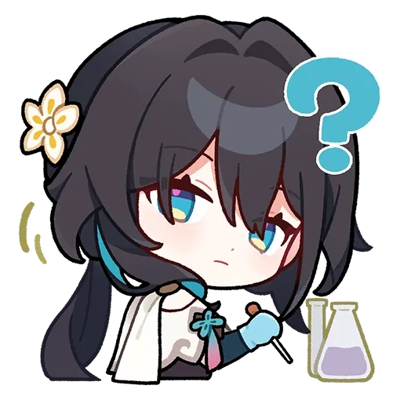
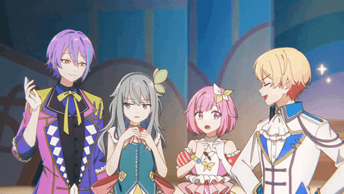

<h1 style="text-align: center;">Hi there, it's Senni!</h1>

  

---

<a href="https://shutterstock.com/g/senni_han">Buy my photograph</a>&emsp;&emsp;
<a href="https://github.com/senni-huemwang">Visit my GitHub</a>&emsp;&emsp;
<a href="https://senni-huemwang.itch.io">Play my games</a>

I'm a linux enthusiast audiophile motorcyclist, nice to meet you! 

## Some brief information about who I am

- My name is Kim, or Senni.
- My pronouns are he/him
- I'm from Thailand, with a military rank being an acting sergeant.
- I'm a cisgender bisexual guy
- I am great with Git, Linux, HTML/CSS/JS, Python, Arduino, Markdown, and Bash, and I am currently learning C, Rust, and Swift.
- I enjoy photography, motorcycling, shooting firearms, racing, and listening to Hi-Fi music.

  

---

## Where to find me 

- [Email me](mailto:shuemwang.han@gmail.com)
- [Shutterstock](https://shutterstock.com/g/senni_han)
- [Senni's Ride & Audio (YouTube Channel)](https://youtube.com/@senni_ride_audio)
- [Github Page](https://github.com/senni-huemwang)
- [X (Formerly Twitter)](https://x.com/senni_eos)
- [Instagram (Personal)](https://instagram.com/senni_kim.390)
- [Instagram (YouTube Channel)](https://instagram.com/senni_ride_audio)
- [Instagram (Photography)](https://instagram.com/senni_photos)

## Interests

- PRSK/PJSK (Project Sekai) (Global)
- Sky: Children Of the Light
- Tetris
- Left 4 Dead 2
- Honkai: Star Rail
- GRID Series
- Motorcycles (espescially KTM)
- Motorsports
- Linux, and FLOSS (Free/Libre and Open Source Software)
- Motovlogging
- Photographing
- Hi-Fi music listening, and audio equipments
- Several Artists (Muse, AURORA, Ado, Various Vocaloid/UTAU/SynthV producers)

  

